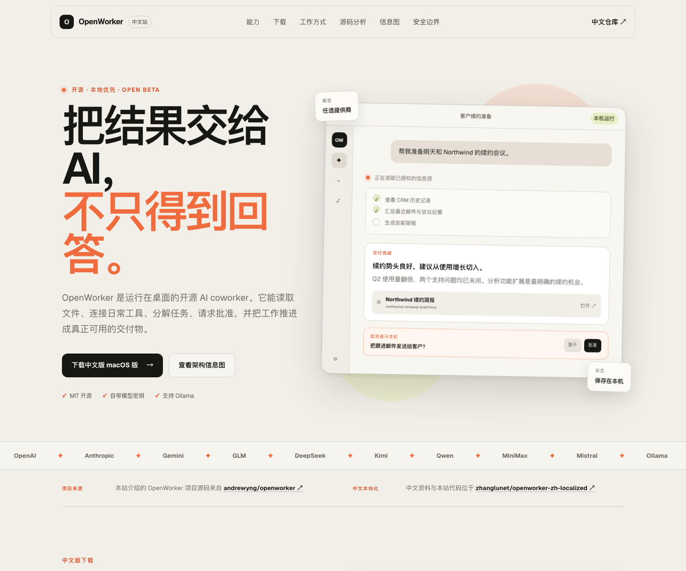

# OpenWorker 全量汉化版（中文 GUI + macOS 桌面客户端）

> 本仓库地址：**https://github.com/zhanglunet/openworker-zh-localized**
>
> 基于 [Lenovo202409/openworker-zh](https://github.com/Lenovo202409/openworker-zh) 二次整理，与上游 [andrewyng/openworker](https://github.com/andrewyng/openworker) 保持功能一致，仅对界面进行了中文本地化。
>
> 遵循原项目 MIT 许可证，仅用于学习和个人本地使用。

<a href="https://trendshift.io/repositories/91434?utm_source=trendshift-badge&amp;utm_medium=badge&amp;utm_campaign=badge-trendshift-91434" target="_blank" rel="noopener noreferrer"></a>

> **Beta** - OpenWorker 仍处于 open beta：功能可用、会持续自动更新，上游仍在快速打磨体验。

## 下载与中文介绍站

- 中文站：[https://oaosf.cn](https://oaosf.cn)
- macOS Apple Silicon DMG：[OpenWorker-CN-0.1.7-aarch64.dmg](https://github.com/zhanglunet/openworker-zh-localized/raw/main/releases/OpenWorker-CN-0.1.7-aarch64.dmg)
- GitHub Release：[v0.1.7-zh](https://github.com/zhanglunet/openworker-zh-localized/releases/tag/v0.1.7-zh)
- 网站源码：[website/](website/)
- 源码深度分析：[https://oaosf.cn/source-analysis](https://oaosf.cn/source-analysis)（仓库内同步保存于 [docs/analysis/](docs/analysis/)）
- 更新日志与周报：[https://oaosf.cn/updates](https://oaosf.cn/updates)（仓库内同步保存于 [docs/updates/](docs/updates/)）
- 企业定制版全套准备文档（PRD、开发计划、三仓同步、部署、换肤打包）：[docs/enterprise/](docs/enterprise/)
- 正式签名、公证与自动更新发布指南：[docs/release-signed-updates.md](docs/release-signed-updates.md)
- 签名材料暂缓申请记录：[docs/release-signing-deferred-plan.md](docs/release-signing-deferred-plan.md)
- 上游项目源码：[andrewyng/openworker](https://github.com/andrewyng/openworker)

中文站汇总了产品能力、工作流程、模型与连接器、源码架构分析、安全边界、交互式信息图、自动更新日志和每周周报。网站明确标注上游项目归属，并链接回本仓库。



> 当前公开 DMG 为未公证的本地化构建。正式签名、公证与 Tauri 自动更新发布链路已文档化，配置 Apple Developer 与 Tauri updater Secrets 后可通过 GitHub Actions 生成正式包。
>
> DMG SHA-256：`0ee522258294655556ce3e0cd04917386f6bdec34c2a5584debd8b84d22be50a`

---

## 目录

- [OpenWorker 全量汉化版（中文 GUI + macOS 桌面客户端）](#openworker-全量汉化版中文-gui--macos-桌面客户端)
  - [下载与中文介绍站](#下载与中文介绍站)
  - [目录](#目录)
  - [1. 为什么做这个汉化版](#1-为什么做这个汉化版)
  - [2. 与原版的主要区别](#2-与原版的主要区别)
  - [3. 支持的运行方式](#3-支持的运行方式)
  - [4. 快速开始（推荐）](#4-快速开始推荐)
    - [4.1 直接下载 macOS 中文版](#41-直接下载-macos-中文版)
    - [4.2 从源码运行](#42-从源码运行)
    - [4.3 一键启动（已经安装过环境的情况）](#43-一键启动已经安装过环境的情况)
  - [5. 第一次安装环境](#5-第一次安装环境)
    - [5.1 macOS 用户无需 sudo 的方式](#51-macos-用户无需-sudo-的方式)
    - [5.2 安装 Python 依赖](#52-安装-python-依赖)
    - [5.3 安装前端依赖](#53-安装前端依赖)
    - [5.4 安装 Rust 工具链（桌面客户端所需）](#54-安装-rust-工具链桌面客户端所需)
  - [6. 使用方式](#6-使用方式)
    - [6.1 方式一：浏览器访问 GUI](#61-方式一浏览器访问-gui)
    - [6.2 方式二：运行 Tauri 桌面客户端（开发模式）](#62-方式二运行-tauri-桌面客户端开发模式)
  - [7. 常见问题](#7-常见问题)
    - [7.1 浏览器里打不开 / 页面白屏](#71-浏览器里打不开--页面白屏)
    - [7.2 Tauri 编译报错缺少 CMake](#72-tauri-编译报错缺少-cmake)
    - [7.3 Tauri 编译报错缺少 sidecar](#73-tauri-编译报错缺少-sidecar)
  - [8. 已汉化的内容](#8-已汉化的内容)
    - [8.1 前端 GUI](#81-前端-gui)
    - [8.2 Tauri 桌面壳](#82-tauri-桌面壳)
  - [9. 仓库结构](#9-仓库结构)
  - [10. 已知问题与后续计划](#10-已知问题与后续计划)
  - [10.1 正式签名、公证与自动更新](#101-正式签名公证与自动更新)
  - [11. 贡献与许可](#11-贡献与许可)

---

## 1. 为什么做这个汉化版

官方 [OpenWorker](https://openworker.com) 是一款很强大的开源本地 AI Agent 桌面应用，但默认界面全英文。对于日常习惯中文操作的用户来说，汉化后更容易上手。

本汉化版的特点：

- **完整保留原项目功能**：只翻译界面文案，不改变底层逻辑。
- **桌面端也汉化**：不仅仅是浏览器里的网页，还汉化了 Tauri 桌面壳的托盘菜单、权限提示、语音输入错误等。
- **无需安装包**：专门为想从源码直接运行的用户准备。
- **无 sudo 安装**：所有工具链都可以安装在用户目录，不会污染系统环境。

---

## 2. 与原版的主要区别

相比官方原版和 Lenovo202409/openworker-zh：

| 项目 | 官方原版 | Lenovo202409/openworker-zh | 本仓库 |
|------|------------|---------------------------|--------|
| 语言 | 英文 | 前端汉化 | 前端 + 桌面壳汉化 |
| 自定义 API | 无 | 有 | 有 |
| 阶跃星辰 StepFun | 无 | 有 | 有 |
| 源码运行教程 | 简略 | 无 | 详细 |
| 环境安装教程 | 无 | 无 | 详细 |
| 启动脚本 | 无 | 无 | 有 |

---

## 3. 支持的运行方式

1. **浏览器访问 GUI** —— 最简单，适合快速体验。
2. **Tauri 桌面客户端（开发模式）** —— 真正的桌面应用，带系统托盘、快捷键、语音输入等。
3. **macOS DMG 安装包** —— 适合 Apple Silicon Mac 用户直接下载体验中文版桌面 App。

> 注意：当前 DMG 为未公证的本地化构建，适合个人本机试用。0.1.7 起中文版 App 的自动更新源已切换到本仓库，避免更新时安装官方英文包；正式签名、公证与自动更新发布流程见 [docs/release-signed-updates.md](docs/release-signed-updates.md)。

---

## 4. 快速开始（推荐）

### 4.1 直接下载 macOS 中文版

适用于 Apple Silicon Mac：

1. 下载：[OpenWorker-CN-0.1.7-aarch64.dmg](https://github.com/zhanglunet/openworker-zh-localized/raw/main/releases/OpenWorker-CN-0.1.7-aarch64.dmg)
2. 打开 DMG，把 `OpenWorker 中文版.app` 拖入“应用程序”。
3. 第一次打开如遇 macOS 安全提示，右键 App 选择“打开”一次。

### 4.2 从源码运行

```bash
git clone https://github.com/zhanglunet/openworker-zh-localized.git
cd openworker-zh-localized
```

### 4.3 一键启动（已经安装过环境的情况）

如果你已经是按第 5 节安装完环境，直接运行：

**终端 1 — 启动后端：**

```bash
bash start-openworker-server.sh
```

**终端 2 — 启动前端（浏览器版）：**

```bash
bash start-openworker-gui.sh
```

然后浏览器打开：http://localhost:1420/

---

## 5. 第一次安装环境

### 5.1 macOS 用户无需 sudo 的方式

如果你的 Mac 上没有 Homebrew、也没有 Python 3.10+、Node 20+、Rust、CMake，可以使用下面的无 sudo 方案。

**安装路径：** `/Users/john/OpenWorker/de8ccae2-dac/local/`
（你可以自由替换成自己的目录）

#### 1) 安装 Python（使用 Miniforge）

```bash
mkdir -p local
cd local
curl -L -o miniforge.sh "https://github.com/conda-forge/miniforge/releases/latest/download/Miniforge3-MacOSX-arm64.sh"
bash miniforge.sh -b -p "$PWD/miniforge3"
rm miniforge.sh

# 验证
local/miniforge3/bin/python --version
```

#### 2) 安装 Node.js 20

```bash
cd local
curl -L -o node.tar.gz "https://nodejs.org/dist/v20.15.1/node-v20.15.1-darwin-arm64.tar.gz"
tar -xzf node.tar.gz
mv node-v20.15.1-darwin-arm64 node
rm node.tar.gz

# 验证
local/node/bin/node --version
```

#### 3) 安装 Rust

```bash
curl --proto '=https' --tlsv1.2 -sSf https://sh.rustup.rs | sh -s -- -y --default-toolchain stable
source "$HOME/.cargo/env"
rustc --version
cargo --version
```

#### 4) 安装 CMake

```bash
cd local
curl -L -o cmake.tar.gz "https://github.com/Kitware/CMake/releases/download/v3.31.5/cmake-3.31.5-macos-universal.tar.gz"
tar -xzf cmake.tar.gz
mv cmake-3.31.5-macos-universal cmake
rm cmake.tar.gz

# 验证
local/cmake/CMake.app/Contents/bin/cmake --version
```

#### 5) 把以上工具加入 PATH

在你的 shell 配置文件（如 `~/.zshrc` 或 `~/.bash_profile`）里添加：

```bash
export PATH="/Users/john/OpenWorker/de8ccae2-dac/local/cmake/CMake.app/Contents/bin:$PATH"
export PATH="/Users/john/OpenWorker/de8ccae2-dac/local/miniforge3/bin:$PATH"
export PATH="/Users/john/OpenWorker/de8ccae2-dac/local/node/bin:$PATH"
export PATH="$HOME/.cargo/bin:$PATH"
```

然后重新打开终端或执行：

```bash
source ~/.zshrc
```

---

### 5.2 安装 Python 依赖

在项目根目录执行：

```bash
# 1. 创建 venv（使用你刚安装的 Miniforge Python）
/Users/john/OpenWorker/de8ccae2-dac/local/miniforge3/bin/python -m venv .venv

# 2. 升级 pip
.venv/bin/python -m pip install --upgrade pip

# 3. 安装项目依赖
.venv/bin/python -m pip install -e ".[messaging,dev]"

# 4. 修复 mcp 版本不兼容问题
.venv/bin/python -m pip install 'mcp>=1.1,<2.0'
```

---

### 5.3 安装前端依赖

```bash
cd surfaces/gui
npm install
```

---

### 5.4 安装 Rust 工具链（桌面客户端所需）

如果想编译 Tauri 桌面客户端，需要：

```bash
# macOS 系统已经自带 Xcode Command Line Tools，如果没有：
xcode-select --install

# 验证 Rust
rustc --version
cargo --version
```

---

## 6. 使用方式

### 6.1 方式一：浏览器访问 GUI

**第一步——启动后端：**

```bash
cd openworker-zh-localized
bash start-openworker-server.sh
```

你会看到类似信息：

```text
INFO:     Started server process [xxx]
INFO:     Uvicorn running on http://127.0.0.1:8765
```

同时在项目根目录会生成运行状态目录：

```text
.openworker-state/sidecar-8765.token
```

这个 token 会自动注入到前端，不需要手动复制。

**第二步——启动前端：**

新开一个终端：

```bash
cd openworker-zh-localized
bash start-openworker-gui.sh
```

你会看到：

```text
VITE v5.4.21  ready in xxx ms

➜  Local:   http://localhost:1420/
➜  Network: http://127.0.0.1:1420/
```

**第三步——打开浏览器：**

- http://localhost:1420/
- http://127.0.0.1:1420/

任意一个都能打开中文 GUI。

---

### 6.2 方式二：运行 Tauri 桌面客户端（开发模式）

桌面客户端需要两个终端（后端 + Tauri开发服务）。

**终端 1 — 启动后端：**

```bash
cd openworker-zh-localized
bash start-openworker-server.sh
```

**终端 2 — 运行 Tauri 开发模式：**

```bash
cd openworker-zh-localized/surfaces/gui
export PATH="/Users/john/OpenWorker/de8ccae2-dac/local/cmake/CMake.app/Contents/bin:$PATH"
export PATH="/Users/john/OpenWorker/de8ccae2-dac/local/miniforge3/bin:$PATH"
export PATH="/Users/john/OpenWorker/de8ccae2-dac/local/node/bin:$PATH"
export PATH="$HOME/.cargo/bin:$PATH"

COWORKER_STATE_DIR=/Users/john/OpenWorker/de8ccae2-dac/.openworker-state \
VITE_COWORKER_API_TOKEN=$(cat /Users/john/OpenWorker/de8ccae2-dac/.openworker-state/sidecar-8765.token) \
npm run tauri dev
```

等待编译完成后，会自动弹出一个带有中文界面的桌面窗口，并在系统托盘栏显示 OpenWorker 图标。

> 提示：第一次编译 Tauri 可能需要 5 ～ 10 分钟下载 Rust crate，请耐心等待。

---

## 7. 常见问题

### 7.1 浏览器里打不开 / 页面白屏

**现象：**前端启动后，浏览器打开 `http://localhost:1420/` 显示白屏，或者很慢。

**原因：** 前端没有正确获取后端的 sidecar token，所有 API 请求被 401/403 拒绝。

**解决：** 使用项目提供的 `start-openworker-gui.sh` 脚本，已经自动处理了 token 注入和 Vite `--host` 参数。

如果你不想用脚本，手动执行：

```bash
cd surfaces/gui
export VITE_COWORKER_API_TOKEN=$(cat ../../.openworker-state/sidecar-8765.token)
npm run dev -- --host
```

---

### 7.2 Tauri 编译报错缺少 CMake

**现象：**

```text
error: failed to run custom build command for `whisper-rs-sys`
```

**原因：** `whisper-rs-sys` 需要 CMake 来构建依赖的 C++ 部分，系统没有 CMake。

**解决：** 按照 5.1 节安装 CMake，并确保 `cmake` 在 PATH 中。

---

### 7.3 Tauri 编译报错缺少 sidecar

**现象：**

```text
resource path `binaries/sidecar` doesn't exist
```

**原因：** Tauri 生产构建（`npm run tauri build`）需要一个打包好的 Python 后端二进制文件放在 `src-tauri/binaries/sidecar`。

**解决：** 如果只是想验证中文桌面界面，使用开发模式即可：

```bash
npm run tauri dev
```

开发模式不需要 sidecar 二进制，它会直接调用本地的 Python 后端。

---

## 8. 已汉化的内容

### 8.1 前端 GUI

以下模块的所有用户可见文案均已翻译为中文：

- 引导页 / 欢迎页
- 设置页：通用、模型、角色、语音输入
- 侧边栏：会话、搜索、收起/展开、产出文件
- 对话界面：输入占位符、复制消息、步骤折叠、运行状态提示
- 审批与收件箱：审批按钮、收件箱、无人值守设置
- 自动化：定时任务、已启动任务状态
- 连接器：连接器列表、各平台配置页、账户详情
- Provider 配置：自定义 API、获取模型列表、测试连接、已保存提示

### 8.2 Tauri 桌面壳

汉化文件：`surfaces/gui/src-tauri/src/lib.rs` 和 `surfaces/gui/src-tauri/Info.plist`

主要汉化项：

| 原文 | 汉化后 |
|------|--------|
| `Open OpenWorker` | `打开 OpenWorker` |
| `Settings` | `设置` |
| `Quit` | `退出` |
| 语音输入的各种不支持/错误提示 | 已翻译为中文 |
| 更新检查提示 | 已翻译为中文 |
| macOS 权限提示（麦克风、桌面、文档、下载、照片库） | 已翻译为中文 |

---

## 9. 仓库结构

```
openworker-zh-localized/
├── coworker/              # Python 后端（Agent 引擎、模型提供商、连接器、MCP 等）
├── surfaces/gui/          # 前端 React + Tauri 桌面壳
│   ├── src/               # React 前端源码（已汉化）
│   └── src-tauri/         # Tauri Rust 桌面壳（已汉化）
├── stt/                   # 语音输入 Rust sidecar
├── tests/                 # Python 后端测试
├── packaging/             # 打包脚本（DMG/Windows）
├── releases/              # 已构建的下载产物
├── website/               # 中文介绍站与信息图页面
├── docs/                  # 设计文档与 README 图片素材
├── start-openworker-server.sh   # 后端一键启动
├── start-openworker-gui.sh      # 前端一键启动
├── BUILD_LOG.md           # 本次完整构建记录
└── README.md            # 本文档
```

---

## 10. 已知问题与后续计划

### 已知问题

1. **GUI E2E 仍有上游英文选择器残留**
   - 现象：上游 Playwright 端到端用例仍绑定部分英文 placeholder/label。
   - 应对：CI 暂时以 Python 测试和 GUI 单元测试作为硬门禁；后续需要把 E2E 选择器迁移到中文界面或稳定的 `data-testid`。

2. **正式自动更新依赖私有签名材料**
   - Apple Developer ID 证书、App Store Connect Notary API Key 和 Tauri updater 私钥不能提交到仓库。
   - 当前决定暂缓申请；记录见 [docs/release-signing-deferred-plan.md](docs/release-signing-deferred-plan.md)，配置方式见 [docs/release-signed-updates.md](docs/release-signed-updates.md)。

### 10.1 正式签名、公证与自动更新

本仓库已经准备好正式发布流水线：

- tag 发布时会强制检查 Apple 签名、公证和 Tauri updater Secrets；
- macOS `.app` / `.dmg` 会签名并公证；
- Tauri `.app.tar.gz` 更新包会生成 `.sig`；
- Release 会上传 `latest-zh.json`；
- workflow 会把 `latest-zh.json` 回写到 `main` 分支的 `releases/latest-zh.json`，兼容已经安装的中文版客户端。

详见：[docs/release-signed-updates.md](docs/release-signed-updates.md)。

### 后续计划

- [ ] 将 GUI E2E 从英文选择器迁移到中文界面或稳定测试 ID
- [ ] 配置 GitHub Actions Secrets 并发布首个正式签名、公证版本
- [ ] 补充 PyInstaller + Tauri build 打包教程
- [ ] 提供 Windows 下的无需管理员环境安装教程

---

## 11. 贡献与许可

- 本汉化版基于 [andrewyng/openworker](https://github.com/andrewyng/openworker) 和 [Lenovo202409/openworker-zh](https://github.com/Lenovo202409/openworker-zh)
- 遵循 MIT 许可证，详见 [LICENSE](LICENSE)
- 感谢原作者打造的优秀工具

---

**最后更新：** 2026-08-04
