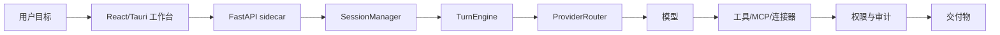

# OpenWorker 中文本地化仓库源码分析

更新时间：2026-08-04T07:37:37+09:00

仓库：zhanglunet/openworker-zh-localized

当前分支：main

当前提交：c6c4704f3bae36130bd4c7585cc6920b395b5fc7

## 1. 总体判断

本仓库是在 OpenWorker 原始项目基础上的中文本地化与中文站扩展版本。它不是单纯的静态翻译包，而是包含桌面 App、Python 本地 Agent 服务、React 工作台、连接器/MCP、打包脚本、中文网站、下载产物和持续文档化页面的一体化仓库。

## 2. 代码规模快照

- 跟踪文件总数：523
- 当前提交：c6c4704
- 主要文件类型：
  - py: 221
  - ts: 105
  - tsx: 77
  - svg: 23
  - png: 22
  - json: 12
  - md: 11
  - [none]: 7
  - html: 5
  - yml: 5
  - mjs: 4
  - rs: 4
  - sh: 4
  - toml: 4
  - css: 3
  - dmg: 2

## 3. 目录结构

- surfaces: 228 个文件
- coworker: 127 个文件
- tests: 93 个文件
- website: 35 个文件
- packaging: 10 个文件
- docs: 6 个文件
- .github: 5 个文件
- stt: 4 个文件
- ui-mocks: 4 个文件
- releases: 3 个文件
- .gitignore: 1 个文件
- BUILD_LOG.md: 1 个文件
- LICENSE: 1 个文件
- openworker-zh-test-report.md: 1 个文件
- pyproject.toml: 1 个文件
- README.md: 1 个文件
- start-openworker-gui.sh: 1 个文件
- start-openworker-server.sh: 1 个文件

## 4. 核心模块

### 桌面壳

Tauri 负责启动窗口、托盘、原生权限、语音输入、更新检查和 Python sidecar 生命周期。

关键路径：
- `surfaces/gui/src-tauri/src/lib.rs`
- `surfaces/gui/src-tauri/tauri.conf.json`

### 前端工作台

React 工作台承载会话、审批、收件箱、连接器、模型配置、产物和实时事件流。

关键路径：
- `surfaces/gui/src/App.tsx`
- `surfaces/gui/src/api.ts`
- `surfaces/gui/src/components`

### 本地服务

FastAPI sidecar 暴露 REST 与 WebSocket，集中协调会话、任务、审计、自动化和持久化。

关键路径：
- `coworker/server/app.py`
- `coworker/server/manager.py`

### Agent 运行核心

TurnEngine、PermissionEngine、工具注册表和 ProviderRouter 组成 model-tool 循环。

关键路径：
- `coworker/engine.py`
- `coworker/permissions.py`
- `coworker/tools`
- `coworker/providers`

### 连接器与 MCP

内置连接器、MCP server 管理和 OAuth/账户视图把外部系统接入本地运行时。

关键路径：
- `coworker/connectors`
- `coworker/mcp`
- `surfaces/gui/src/connectors`

### 中文站与发布物

中文站、架构信息图、源码分析、日志周报和 macOS DMG 下载入口随仓库维护。

关键路径：
- `website`
- `docs`
- `releases`

## 5. 运行链路

1. 下载 DMG 或源码启动
2. Tauri/浏览器加载 GUI
3. sidecar 选择端口并生成 token
4. GUI 通过 REST/WebSocket 连接本地服务
5. 用户发起目标与上下文
6. 模型提出计划与工具调用
7. 权限系统判断风险与批准策略
8. 工具结果写入会话、审计、Inbox 或文件
9. 最终结果返回用户

## 6. 架构流程图

## 7. API 与 MCP

- 健康与启动: /v1/health、WebSocket /ws/events
- 会话: /v1/sessions、/ws/session/{sessionId}
- 模型提供商: /v1/providers、/v1/providers/models
- 连接器: /v1/connectors/*、OAuth 状态轮询
- MCP: /v1/mcp/*、stdio / streamable-http server
- 自动化与 Inbox: /v1/automations/*、/v1/inbox/*
- 本地文件与产物: 文件工具、目录授权、产物预览

## 8. 最近更新

- 2026-08-04 c6c4704 docs: refresh reports after Cloudflare deploy
- 2026-08-03 6aeb622 docs: refresh generated site reports
- 2026-08-04 f4fabd1 sync: merge upstream OpenWorker 01b6f83 (#2)
- 2026-08-03 7df3ca0 docs: refresh generated site reports
- 2026-08-04 a6b5334 docs: add source analysis and update reports pages
- 2026-08-04 f36b220 Update README download and site preview
- 2026-08-04 11fd242 Add localized macOS app download
- 2026-08-04 6a46c2a Distinguish Chinese macOS app bundle
- 2026-08-03 96db0d2 Add OpenWorker architecture infographic page
- 2026-08-03 0759ba3 Add Cloudflare deployment config for website
- 2026-08-03 cc6d867 Merge pull request #1 from zhanglunet/agent/add-openworker-cn-site
- 2026-08-03 617c4fb Add OpenWorker Chinese website
