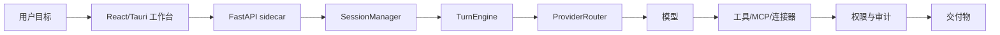

# OpenWorker 中文本地化仓库源码分析

更新时间：2026-08-06T00:09:49Z

仓库：zhanglunet/openworker-zh-localized

当前分支：main

当前提交：73477600c218daca063a7d0e50f828e9d7d9df7f

## 1. 总体判断

本仓库是在 OpenWorker 原始项目基础上的中文本地化与中文站扩展版本。它不是单纯的静态翻译包，而是包含桌面 App、Python 本地 Agent 服务、React 工作台、连接器/MCP、打包脚本、中文网站、下载产物和持续文档化页面的一体化仓库。

## 2. 代码规模快照

- 跟踪文件总数：558
- 当前提交：7347760
- 主要文件类型：
  - py: 235
  - ts: 105
  - tsx: 78
  - md: 26
  - svg: 23
  - png: 22
  - json: 12
  - yml: 9
  - [none]: 7
  - html: 5
  - sh: 5
  - mjs: 4
  - rs: 4
  - toml: 4
  - css: 3
  - dmg: 2

## 3. 目录结构

- surfaces: 228 个文件
- coworker: 127 个文件
- tests: 93 个文件
- docs: 38 个文件
- website: 36 个文件
- packaging: 10 个文件
- .github: 7 个文件
- stt: 4 个文件
- ui-mocks: 4 个文件
- releases: 3 个文件
- .gitignore: 1 个文件
- BUILD_LOG.md: 1 个文件
- LICENSE: 1 个文件
- openworker-zh-test-report.md: 1 个文件
- pyproject.toml: 1 个文件
- README.md: 1 个文件
- start-openworker-gui.sh: 1 个文件
- start-openworker-server.sh: 1 个文件

## 4. 核心模块

### 桌面壳

Tauri 负责启动窗口、托盘、原生权限、语音输入、更新检查和 Python sidecar 生命周期。

关键路径：
- `surfaces/gui/src-tauri/src/lib.rs`
- `surfaces/gui/src-tauri/tauri.conf.json`

### 前端工作台

React 工作台承载会话、审批、收件箱、连接器、模型配置、产物和实时事件流。

关键路径：
- `surfaces/gui/src/App.tsx`
- `surfaces/gui/src/api.ts`
- `surfaces/gui/src/components`

### 本地服务

FastAPI sidecar 暴露 REST 与 WebSocket，集中协调会话、任务、审计、自动化和持久化。

关键路径：
- `coworker/server/app.py`
- `coworker/server/manager.py`

### Agent 运行核心

TurnEngine、PermissionEngine、工具注册表和 ProviderRouter 组成 model-tool 循环。

关键路径：
- `coworker/engine.py`
- `coworker/permissions.py`
- `coworker/tools`
- `coworker/providers`

### 连接器与 MCP

内置连接器、MCP server 管理和 OAuth/账户视图把外部系统接入本地运行时。

关键路径：
- `coworker/connectors`
- `coworker/mcp`
- `surfaces/gui/src/connectors`

### 中文站与发布物

中文站、架构信息图、源码分析、日志周报和 macOS DMG 下载入口随仓库维护。

关键路径：
- `website`
- `docs`
- `releases`

## 5. 运行链路

1. 下载 DMG 或源码启动
2. Tauri/浏览器加载 GUI
3. sidecar 选择端口并生成 token
4. GUI 通过 REST/WebSocket 连接本地服务
5. 用户发起目标与上下文
6. 模型提出计划与工具调用
7. 权限系统判断风险与批准策略
8. 工具结果写入会话、审计、Inbox 或文件
9. 最终结果返回用户

## 6. 架构流程图

## 7. API 与 MCP

- 健康与启动: /v1/health、WebSocket /ws/events
- 会话: /v1/sessions、/ws/session/{sessionId}
- 模型提供商: /v1/providers、/v1/providers/models
- 连接器: /v1/connectors/*、OAuth 状态轮询
- MCP: /v1/mcp/*、stdio / streamable-http server
- 自动化与 Inbox: /v1/automations/*、/v1/inbox/*
- 本地文件与产物: 文件工具、目录授权、产物预览

## 8. 企业定制扩展点

企业定制版（私有仓）可以在不重写核心的前提下，按下列层次定制。完整方案见 `docs/enterprise/`（PRD、开发计划、三仓同步、部署、换肤打包）。

### 模型层 · 私有模型（配置级）

Provider 注册表内置 Custom（OpenAI 兼容 base_url）与 Ollama 构建器，企业 vLLM/网关的端点、端口与模型版本直接配置接入；模型能力在能力矩阵登记。

关键路径：
- `coworker/providers/registry.py`
- `coworker/providers/matrix.py`
- `docs/config.example.toml`

### 技能层 · 企业技能包（资产级）

SKILL.md 规范（YAML frontmatter + 渐进式加载），全局 state_dir()/skills 与工作区 .coworker/skills 双目录；企业 SOP 技能与大表哥 excel-ai-analyst 预置即用。

关键路径：
- `coworker/skills/base.py`
- `coworker/skills/store.py`

### 知识层 · 企业知识库（资产级起步）

无内置向量 RAG；现实路径是文件根挂载 + 技能内置知识起步，中期把企业知识库封装成 MCP 检索服务，权限留在知识库侧。

关键路径：
- `coworker/roots.py`
- `coworker/project.py`
- `coworker/memory`

### 工具层 · 企业 CLI 与内部系统（配置级 + 代码级）

企业 CLI 首选封装为 MCP server 注册；内部系统按连接器 descriptor 模式扩展；allowed_commands 白名单与审批模式管控执行边界。

关键路径：
- `coworker/mcp`
- `coworker/connectors/descriptors.py`
- `coworker/cli.py`

### 专属功能 · 大表哥表格助手（三层渐进）

L1 预置 excel-ai-analyst 技能（表格当代码逆向：探测/公式链/全量验证）→ L2 前端表格助手入口 → L3 excel_ai 注册为内置工具。

关键路径：
- `coworker/tools`
- `surfaces/gui/src/App.tsx`

### 品牌层 · 换肤与命名（资产级）

颜色单一事实源是 styles.css 的 CSS 变量（Tailwind 仅映射 token），换肤=覆盖一个变量块；应用名/Bundle ID/图标/更新源集中在 tauri.conf.json。

关键路径：
- `surfaces/gui/src/styles.css`
- `surfaces/gui/tailwind.config.js`
- `surfaces/gui/src-tauri/tauri.conf.json`

### 同步层 · 三仓不覆盖同步（流水线）

上游→汉化版每日自动合并开 PR、冲突自动开 Issue；企业私有仓复制同款流水线单向对接汉化仓，配合 enterprise/ 目录隔离与挂载点纪律实现定制零覆盖。

关键路径：
- `.github/workflows/sync-upstream.yml`

### 发布层 · 多平台打包与更新（流水线）

发布矩阵覆盖 macOS Apple Silicon/Intel 双 DMG 与 Windows MSI/NSIS，latest-zh.json 驱动 Tauri 自动更新；企业版换名称、签名密钥与更新源即用。

关键路径：
- `.github/workflows/release.yml`
- `packaging/build_dmg.sh`
- `packaging/make_update_manifest.py`

## 9. 最近更新

- 2026-08-06 7347760 fix(automation): 定时任务在 skip-on-overlap 下仍可能重复执行
- 2026-08-05 3923f58 docs: refresh generated site reports
- 2026-08-05 5f790df feat(enterprise): 大表哥 excel-ai-analyst 技能包（PRD F4 的 L1 层）
- 2026-08-05 661dfe9 docs: refresh generated site reports
- 2026-08-05 6cbe8c2 docs(enterprise): 新增可直接执行的企业仓模板（建仓/同步/冒烟/发布）
- 2026-08-05 1647e48 docs: refresh generated site reports
- 2026-08-05 12a7c83 fix(windows): MSI 打包指定 zh-CN WiX 语言，修复中文产品名构建失败
- 2026-08-05 0394aa2 docs: refresh generated site reports
- 2026-08-05 8546ba0 ci: 测试版 Windows 只出 NSIS，并加 MSI 中文代码页诊断实验
- 2026-08-05 fb1b810 docs: refresh generated site reports
- 2026-08-05 fc875a3 ci: 测试版流水线支持手动触发发布并修正校验和生成
- 2026-08-05 ab204cf docs: refresh generated site reports
